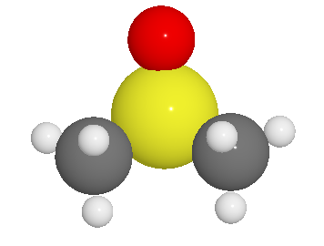
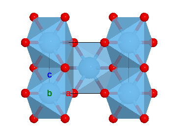
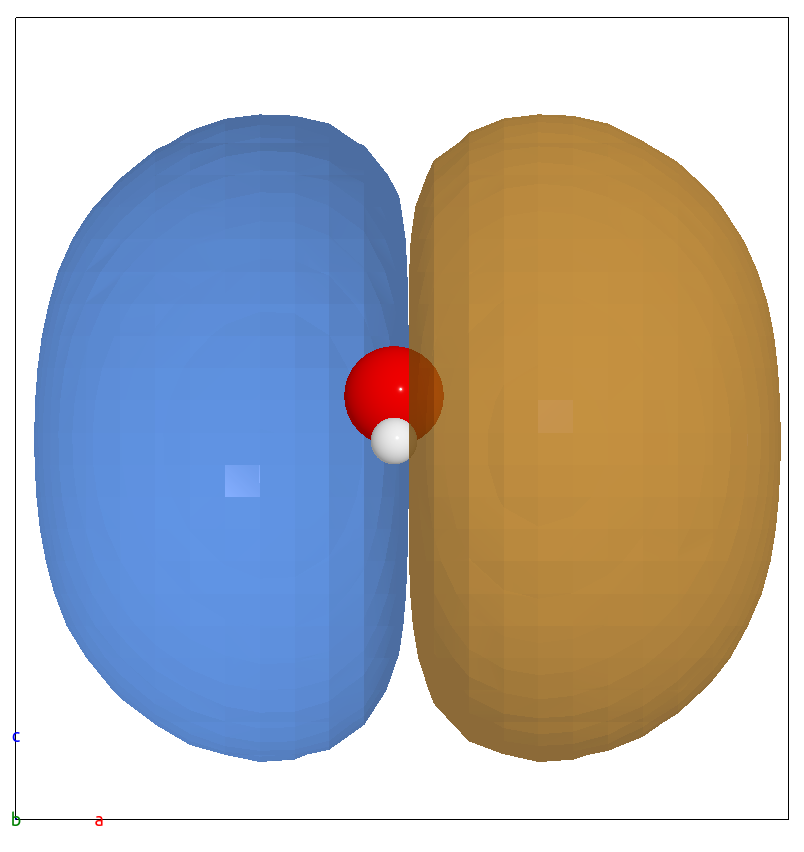
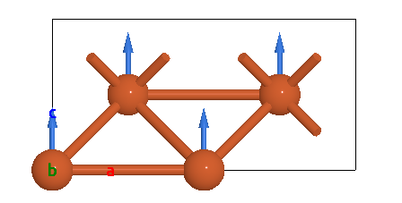
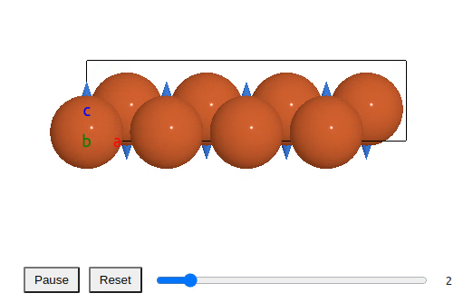
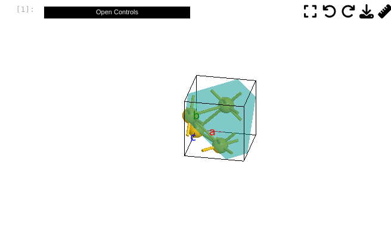

# Welcome to WEAS Widget!
[](https://badge.fury.io/py/weas-widget)
[](http://weas-widget.readthedocs.io/)
[](https://github.com/superstar54/weas-widget/actions/workflows/ci.yml)

A widget to visualize and edit atomic structures in Jupyter Notebooks. It uses [WEAS](https://github.com/superstar54/weas) (Web Environment For Atomistic Structure) in the backend.


Features:

- Model: space-filling, ball-stick, polyhedral.
- Supports importing data from ASE and Pymatgen.
- Edit structure: move, rotate, delete and replace atoms.
- Supports periodic boundary conditions
- Animations
- Isosurfaces
- Vector fields, e.g., magnetic moments, phonons, ...


## Installation

With `pip`:

```console
pip install weas-widget
```

To install the latest version from source, first clone the repository and then install using `pip`:

```console
git clone https://github.com/superstar54/weas-widget
cd weas-widget
npm install
npm run build
pip install -e .
```

## How to use

```python
from ase.build import molecule
from weas_widget import WeasWidget
atoms = molecule("C2H6SO")
viewer = WeasWidget()
viewer.from_ase(atoms)
viewer
```




Full documentation at: https://weas-widget.readthedocs.io/en/latest/index.html


## Reporting issues
If you encounter any problems, please first update the widget to the latest version.

```console
    pip install weas-widget  --upgrade
```

If the problem persists, please open a [GitHub issue](https://github.com/superstar54/weas-widget/issues)


## Features


### Select Atoms
- Pick Selection: Click directly on an atom to select it.
- Range Selection: Hold the `Shift` key and drag the right mouse button to select a group of atoms.

### Move, Rotate selected atoms

Press the keyboard shortcut, and move your mouse.

|Operation | Shortcut|
|----------|---------|
| Move     | `g`   |
| Rotate   | `r`   |
| Duplicate| `d`   |


### Delete selected atoms
Press the ``Delete`` key


### Export
- Export the modified atomic structure to ASE or Pymatgen
```python
atoms = viewer.to_ase()
```
- Save image to a path by:
```python
viewer.save_image("/home/xing/filename.png")
```
- Download image by:
```python
viewer.download_image("filename.png")
```

### Visualizing crystal structures
For a nice visualization of a crystal, show
- unit cell
- bonded atoms outside the cell
- polyhedra

```python
from weas_widget import WeasWidget
viewer1 = WeasWidget()
viewer1.load_example("tio2.cif")
viewer1.avr.model_style = 2
viewer1.avr.boundary = [[-0.1, 1.1], [-0.1, 1.1], [-0.1, 1.1]]
viewer1.avr.show_bonded_atoms = True
viewer1.avr.color_type = "VESTA"
viewer1
```




### Isosurfaces

```python
from ase.build import molecule
from weas_widget import WeasWidget
from ase.io.cube import read_cube_data
volume, atoms = read_cube_data("h2o-homo.cube")
viewer = WeasWidget()
viewer.from_ase(atoms)
viewer.avr.iso.volumetric_data = {"values": volume}
viewer.avr.iso.settings = [{"isovalue": 0.0001, "mode": 0}]
viewer
```



### Magnetic moments
Show the magnetic moments as a vector field.

```python
from ase.build import bulk
from weas_widget import WeasWidget
import numpy as np
atoms = bulk("Fe", cubic=True)
atoms*=[2, 2, 1]
atoms.set_array("moment", np.ones(len(atoms)))
viewer = WeasWidget()
viewer.from_ase(atoms)
viewer.avr.model_style = 1
viewer
```



### Phonons
Animate vibrational (phonon) modes (computed with external software).

```python
import numpy as np
from ase.build import bulk
from weas_widget import WeasWidget
from weas_widget.utils import generate_phonon_trajectory

atoms = bulk("Fe", cubic=True)
eigenvector = np.array([[0, -0.0, 0.5], [0, 0.0, -0.5]])
trajectory = generate_phonon_trajectory(atoms, eigenvector, repeat=[4, 4, 1])
viewer = WeasWidget()
viewer.from_ase(trajectory)
# set a vector field to show the arrow
viewer.avr.vf.settings = [{"origins": "positions", "vectors": "movement", "radius": 0.1}]
viewer.avr.vf.show = True
viewer
```



### Lattice plane
Draw a plane that is defined by the miller indices and distance from the origin or by selecting the atoms.

```python
viewer.avr.lp.add_plane_from_indices(name = "111",
                                     indices = [1, 1, 1],
                                     distance = 4,
                                     scale = 1.0,
                                     color = [0, 1, 1, 0.5])
viewer.avr.lp.build_plane()
```




## Test

### Unit test

```console
pytest
```

### End-to-end test

The e2e test is similar to [ipywidgets](https://ipywidgets.readthedocs.io/en/latest/dev_testing.html).

For the first time, one needs to install the dependence.

```
cd tests/notebooks/
yarn install
```

Then run in a terminal:

```
yarn start
```

In another terminal:

```
yarn test
```

If the snapshots need to be updated:

```
yarn test:update
```

## Contact
* Xing Wang  <xingwang1991@gmail.com>

## License
[MIT](http://opensource.org/licenses/MIT)
