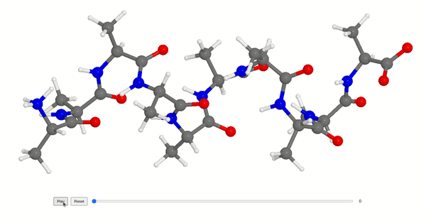

=======================
Animation
=======================

WeasWidget supports animations using a **list of ASE Atoms objects** or an **ASE Trajectory**.

Example: Rotating a Molecule
============================

.. code-block:: python

    from ase.build import molecule
    from weas_widget import WeasWidget

    atoms = molecule("C2H6SO")
    images = [atoms.copy().rotate("z", i) for i in range(0, 360, 10)]

    viewer = WeasWidget()
    viewer.from_ase(images)
    viewer.avr.model_style = 1
    viewer

Animation Controls
==================

**Timeline Interaction**

- You can play the animation using the timeline bar.
- In **play mode**, only atomic positions are updated, preventing unnecessary re-drawing of bonds and polyhedra.
- In **pause mode**, behavior depends on the `continuous_update` setting.

**Continuous Update Behavior**
------------------------------
You can toggle this setting as follows:

.. code-block:: python

    viewer.avr.continuous_update = False

- Enabled (default):

  - The entire visualization (bonds, image atoms, polyhedra) updates dynamically as the user drags the timeline slider.
  - This provides real-time feedback but may be computationally expensive for large systems.

- Disabled:

  - The model updates only when the user releases the timeline slider.
  - This reduces rendering overhead and improves performance for large animations.
