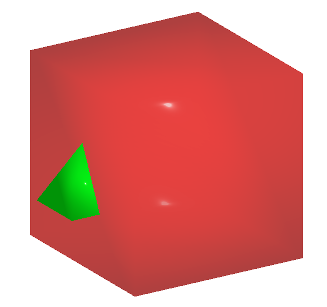

Any Mesh
=================
This module allow user to draw any custom geometry.

The following example shows how to draw mesh using vertices and faces.

.. code-block:: python

    from weas_widget import WeasWidget
    viewer = WeasWidget()
    data = [
    {
        "name": "tetrahedron",
        "color": [0.0, 1.0, 0.0, 1.0],
        "material": "Standard",
        "position": [-3.0, 0.0, 0.0],
        "vertices": [0.0, 1.0, 0.0, -1.0, -1.0, 1.0, 1.0, -1.0, 1.0, 1.0, -1.0, -1.0, -1.0, -1.0, -1.0],
        "faces": [0, 1, 2, 0, 2, 3, 0, 3, 4, 0, 4, 1, 1, 4, 3, 3, 2, 1]
    },
    {
        "name": "cube",
        "color": [1.0, 0.0, 0.0, 0.5],
        "material": "Standard",
        "vertices": [-3.0, -3.0, -3.0, -3.0, -3.0, 3.0, -3.0, 3.0, -3.0, -3.0, 3.0, 3.0, 3.0, -3.0, -3.0, 3.0, -3.0, 3.0, 3.0, 3.0, -3.0, 3.0, 3.0, 3.0],
        "faces": [0, 1, 2, 1, 3, 2, 4, 6, 5, 6, 7, 5, 4, 5, 0, 5, 1, 0, 6, 2, 7, 2, 3, 7, 0, 2, 4, 2, 6, 4, 1, 5, 3, 5, 7, 3]
    }
    ]

    viewer.any_mesh.settings = data
    viewer

