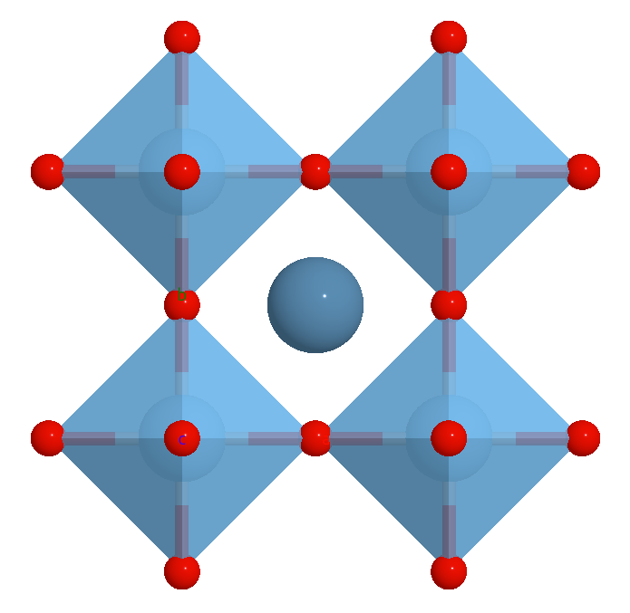

Bond
===============
Use can control the bond using `avr.bond.settings`. For example, we delete the bond between Ca and Ti, and Ti and Ca.

.. code-block:: python

    # it's important to deepcopy the settings
    settings = viewer1.avr.bond.settings.copy()
    del settings['[Ti, Ca]']
    del settings['[Ca, Ti]']
    # it's important to update the settings as a whole
    viewer1.avr.bond.settings = settings

