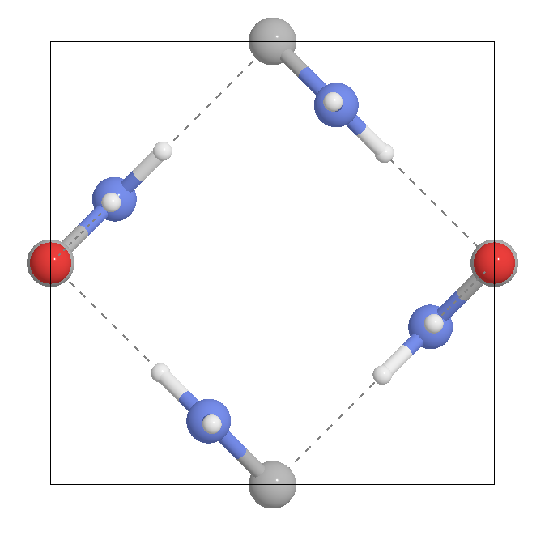

Bond
===============
Use can control the bond using `avr.bond.settings`.

Delete bond pair
----------------

For example, we delete the bond between Ca and Ti, and Ti and Ca.

.. code-block:: python

    # delete the bond between Ca and Ti
    del viewer.avr.bond.settings['Ti-Ca']
    # change the bond color between Ti and O
    viewer.avr.bond.settings['Ti-O'].update({"color": "red"})
    # change the maximum bond length between Ti and O
    viewer.avr.bond.settings['Ti-O']["max"] = 3.0

Add bond pair
-------------

.. code-block:: python

    # add the bond between Pt and Au
    viewer.avr.bond.add_bond_pair('Pt', 'Au', max=3.2)

Hydrogen bond
-------------
The hydrogen bond can be controlled using `avr.bond.show_hydrogen_bonds`:

.. code-block:: python

    # set hydrogen bond length parameters for H-O
    viewer.avr.bond.settings['H-O']["min"] = 1.5
    viewer.avr.bond.settings['H-O']["max"] = 2.5
    # show hydrogen bonds
    viewer.avr.bond.show_hydrogen_bonds = True

