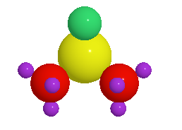

Color
===============

One can color the atoms using the following scheme:

- Element
- Random
- Uniform
- Index
- Attribute

Color by element
----------------

Supported style are:

#. **JMOL**: http://jmol.sourceforge.net/jscolors/#color_U
#. **VESTA**: https://jp-minerals.org/vesta/en/
#. **CPK**: https://en.wikipedia.org/wiki/CPK_coloring

-----------------------------
Custom color for each species
-----------------------------
Use can set custom color for each species. The color can be in the form of hex code or color name.

.. code-block:: python

    from ase.build import molecule
    from weas_widget import WeasWidget
    atoms = molecule("C2H6SO")
    viewer = WeasWidget()
    viewer.from_ase(atoms)
    # set the color and radius for each species
    # it's important to deepcopy the settings
    settings = deepcopy(viewer.avr.species.settings)
    settings["C"].update({"color": "red", "radius": 1.0})
    settings["H"].update({"color": "green", "radius": 0.5})
    settings["O"].update({"color": "blue", "radius": 0.6})
    settings["S"].update({"color": "yellow", "radius": 1.2})
    # it's important to update the settings as a whole
    viewer.avr.species.settings = settings
    viewer

Color by attribute
----------------------
Coloring based on the attribute of the atoms. The attribute can be: charge, magmom, or any other attribute in the structure.

Here we show how to color the atoms by their forces.

.. code-block:: python

    from ase.build import bulk
    from ase.calculators.emt import EMT
    import numpy as np
    from weas_widget import WeasWidget

    atoms = bulk('Au', cubic = True)
    atoms *= [3, 3, 3]
    atoms.positions += np.random.random((len(atoms), 3))
    atoms.calc = EMT()
    atoms.get_potential_energy()
    # set the forces as an attribute
    atoms.set_array("Force", atoms.calc.results["forces"])

    viewer = WeasWidget()
    viewer.from_ase(atoms)
    viewer.avr.color_by = "Force"
    viewer.avr.color_ramp = ["red", "yellow", "blue"]
    viewer.avr.model_style = 1
    viewer

.. image:: _static/images/example_color_by_force.png
   :width: 10cm
