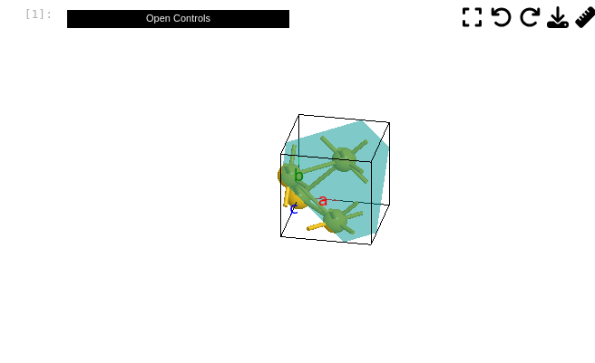

=========
Gallery
=========

Model type
==========

.. list-table::
   :widths: 25 25 25 25

   * - Ball
     - Ball-and-stick
     - Polyhedral
     - Wireframe
   * -  |crystal1|
     -  |crystal2|
     -  |crystal3|
     -  |crystal4|

Volumetric data
======================

Isosurface
--------------

.. image:: _static/images/example-isosurface.png
   :width: 8cm

Phonon visualization
=======================

.. image:: _static/images/example-phonon.gif
   :width: 10cm

Color by attribute
=======================
Color by attribute is a powerful tool to visualize the data. Here we show how to color the atoms by their forces.

.. image:: _static/images/example_color_by_force.png
   :width: 10cm

Lattice plane
=================

Animation
============

.. image:: _static/images/animation_md.gif
   :width: 15cm

