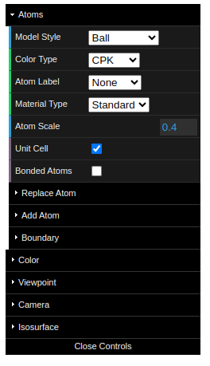
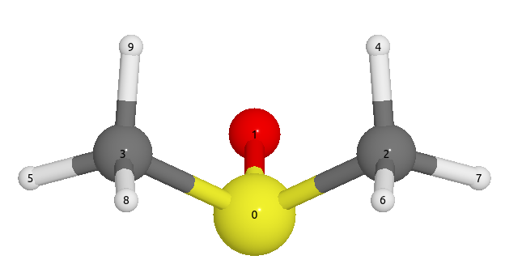

==================
GUI controls
==================

The graphical user-interface (GUI) allows users to set up and control the visualization of the atomic structure. It has the following components:

- Fix GUI:
   - Main controls (top left)
   - Buttons (top right)
- Dynamic GUI:
   - Adjust last operation (bottom left)
   - Timebar for animations (bottom middle)

Main Controls
==============
One can open the control panel by clicking the `open controls` button on the top left. It has the following settings:

Model style
----------------

Here, four models are supported.

.. list-table::
   :widths: 25 25 25 25

   * - **Ball**
     - **Ball-and-stick**
     - **Polyhedral**
     - **Stick**
   * -  .. image:: _static/images/model_style_0.png
     -  .. image:: _static/images/model_style_1.png
     -  .. image:: _static/images/model_style_2.png
     -  .. image:: _static/images/model_style_3.png

.. tip::

   The Model Style setting applies exclusively to selected atoms. If no atoms are selected, it will apply to all atoms in the model.

Color style
----------------
Supported style are:

#. **JMOL**: http://jmol.sourceforge.net/jscolors/#color_U
#. **VESTA**: https://jp-minerals.org/vesta/en/
#. **CPK**: https://en.wikipedia.org/wiki/CPK_coloring

Label
----------------
One can add label for each atoms.

You can input string like:

- `symbol`
- `index`

Here is a example of a molecule with `index` label:

Other parameters:
------------------

- **Atom Scale**: change scale for all atoms.
- **Unit Cell**: show or hide the unit cell.
- **Bonded Atoms**: show or hide the bonded atoms outside the unit cell.
- **Replace Atom**: replace the selected atom with another atom.
- **Add Atom**: add a new atom to the structure.
- **Boundary**: show atoms inside the boundary, making a supercell.

Buttons
---------
There are several buttons on the top right of the GUI. They are:

- **Fullscreen**: enter or exit fullscreen mode.
- **Undo**: undo the last operation.
- **Redo**: redo the last operation.
- **Download**: download the current structure as a .cif file.
- **Measurement**: measure the distance between two atoms.

Configuration
===================
One can use a configuration dict to specify their GUI preferences, such as enabling/disabling the GUI entirely or choosing specific components to display.

Disable the GUI entirely
--------------------------
.. code-block:: python

   from weas_widget import WeasWidget
   viewer = WeasWidget(guiConfig={"enabled": False})
   viewer

Select specific components
--------------------------

.. code-block:: python

   from weas_widget import WeasWidget
   guiConfig={"enabled": True,
              "components": {"atomsControl": True,
                             "buttons": True},
              "buttons": {"fullscreen": True,
                          "download": True,
                          "measurement": True,
                          }
            }
   viewer = WeasWidget(guiConfig=guiConfig)
   viewer

Set viewer width and height
----------------------------

.. code-block:: python

   from weas_widget import WeasWidget
   viewer = WeasWidget(viewerStyle = {"width": "800px", "height": "600px"})
   viewer
