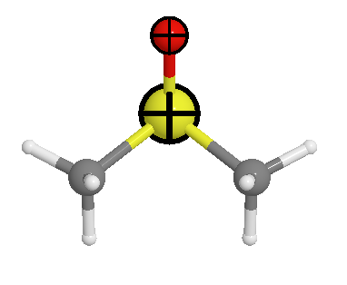

Highlight atoms
===============

One can highlight the atoms using the following shapes:

- sphere
- box
- cross

One can see the highlight setting:

.. code-block:: python

    viewer.avr.highlight.settings

The default settings has `selection` and `fixed` items, which are used to highlight the selected atoms and fixed atoms, respectively.

Add highlight item
-------------------
One can add one highlight item with the following code:

.. code-block:: python

    # highlight the first two atoms with a cross, e.g., show the atoms which are fixed
    viewer.avr.highlight.settings['my_highlight'] = {"type": "cross", "indices": [0, 1], "color": "black"}
    viewer.avr.draw()
    viewer

