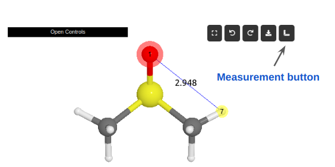

Measurement
==================

It offers interactive capabilities to measure  distances, angles, and positions directly on the viewer.

   Example of the measurement tool in action. The distance between two atoms is being measured.

Usage Instructions
------------------

To initiate a measurement, users should first select the desired atoms within the viewer and then click the ``measurement`` button (icon of a ruler).
The type of measurement performed automatically adapts based on the number of atoms selected, as outlined below:

- **No atoms selected**: Clears all previous measurements displayed in the scene.

- **Single atom selected**: Displays the selected atom's xyz coordinates and its atomic symbol.

- **Two atoms selected**: Calculates and displays the interatomic distance between the two selected atoms.

- **Three atoms selected**: Measures and shows the angle formed by the bonds between the first and second atoms, and the second and third atoms (i.e., the angle across bonds 12 and 23).

- **Four atoms selected**: Computes and visualizes the dihedral angle between the planes formed by the first two and the last two bonds (i.e., the angle between bonds 12 and 34).
