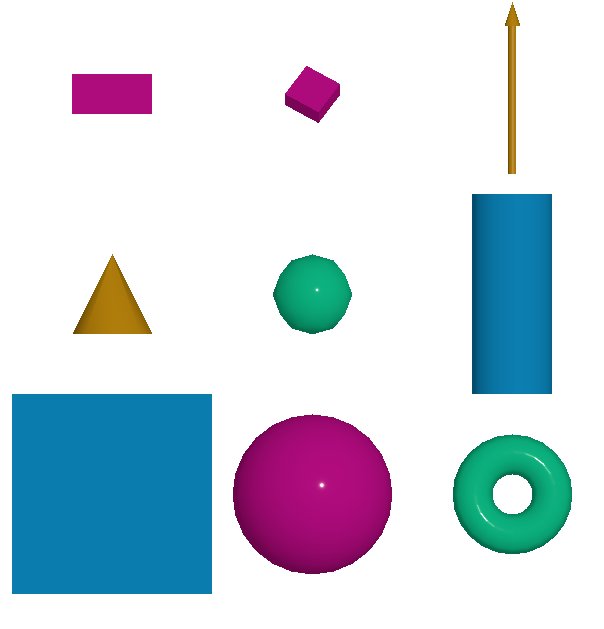
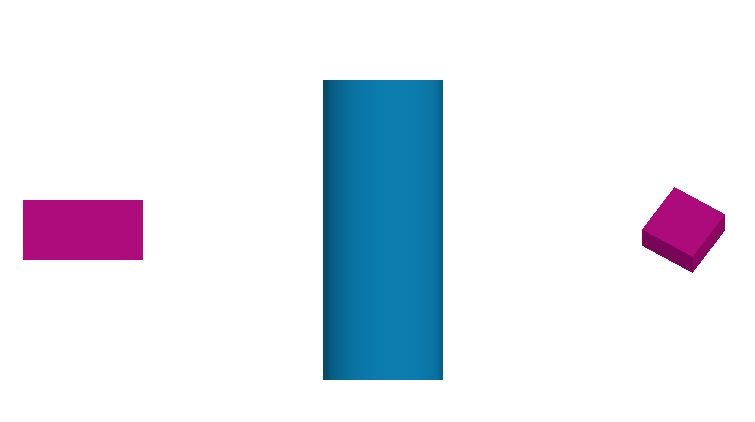

Mesh Primitive
=================
This module allow user to draw custom geometry. The supported geometry are:

- plane
- box
- sphere
- cylinder
- icosahedron
- cone
- torus
- arrow

Example
-----------------------------
The following example shows how to use the mesh primitive to draw two cubes and a sphere.

.. code-block:: python

    from weas_widget import WeasWidget
    viewer = WeasWidget()
    data = [
        {
            "type": "cube",
            "data": [
                {
                    "position": [-5, 0, 0],
                    "size": 2,
                    "scale": [1, 0.5, 1],
                    "rotation": [0, 0, 0]
                },
                {
                    "position": [5, 0, 1],
                    "size": 1,
                    "scale": [1, 0.5, 1],
                    "rotation": [1, 1, 0],
                    "color": "#bd0d87"
                }
            ]
        },
        {
            "type": "cylinder",
            "data": [
                {
                    "position": [0, 0, 0],
                    "segments": 12,
                    "radius": 1,
                    "depth": 5,
                    "scale": [1, 1, 1],
                    "rotation": [0, 0, 0],
                    "color": "#0d87bd"
                }
            ]
        },
    ]

    viewer.imp.settings = data
    viewer

Primitive Parameters
-----------------------------

Cube
~~~~~~~~~~~~~~~~~~~~~~~~~~~
The cube is defined by the following parameters:

.. code-block:: python

    {
     "position": [0, 0, 0],
     "size": 2,
     "scale": [1, 1, 1],
     "rotation":[0, 0, 0],
     "color": "#bd0d87",
     "materialType": "Standard",
    }

Cylinder
~~~~~~~~~~~~~~~~~~~~~~~~~~~
The cylinder is defined by the following parameters:

.. code-block:: python

    {
     "position": [0, 0, 0],
      "segments": 12,
      "radius": 1,
      "depth": 2,
      "scale": [1, 1, 1],
      "rotation":[0, 0, 0],
      "color": "#bd0d87",
    }

Sphere
~~~~~~~~~~~~~~~~~~~~~~~~~~~
The sphere is defined by the following parameters:

.. code-block:: python

    {
     "position": [0, 0, 0],
      "widthSegments": 8,
      "heightSegments": 6,
      "radius": 1,
      "scale": [1, 1, 1],
      "rotation":[0, 0, 0],
      "color": "#bd0d87",
    }

Plane
~~~~~~~~~~~~~~~~~~~~~~~~~~~
The plane is defined by the following parameters:

.. code-block:: python

    {
     "position": [0, 0, 0],
      "size": 2,
      "scale": [1, 1, 1],
      "rotation":[0, 0, 0],
      "color": "#bd0d87",
    }

Icosahedron
~~~~~~~~~~~~~~~~~~~~~~~~~~~
The icosahedron is defined by the following parameters:

.. code-block:: python

    {
     "position": [0, 0, 0],
      "radius": 1,
      "detail": 2,
      "scale": [1, 1, 1],
      "rotation":[0, 0, 0],
      "color": "#bd0d87",
    }

Cone
~~~~~~~~~~~~~~~~~~~~~~~~~~~
The cone is defined by the following parameters:

.. code-block:: python

    {
     "position": [0, 0, 0],
      "segments": 8,
      "radius": 1,
      "height": 2,
      "scale": [1, 1, 1],
      "rotation":[0, 0, 0],
      "color": "#bd0d87",
    }

Arrow
~~~~~~~~~~~~~~~~~~~~~~~~~~~
The arrow is defined by the following parameters:

.. code-block:: python

    {
     "position": [0, 0, 0],
      "direction": [0, 0, 1],
      "length": 1,
      "color": "#bd0d87",
      "materialType": "Standard",
    }

Torus
~~~~~~~~~~~~~~~~~~~~~~~~~~~
The torus is defined by the following parameters:

.. code-block:: python

    {
     "position": [0, 0, 0],
      "radius": 1,
      "tube": 0.4,
      "radialSegments": 8,
      "tubularSegments": 6,
      "scale": [1, 1, 1],
      "rotation":[0, 0, 0],
      "color": "#bd0d87",
    }

.. tip::
    Please check the `three.js documentation <https://threejs.org/manual/?q=primi#en/primitives>`_ for more information about the parameters.
