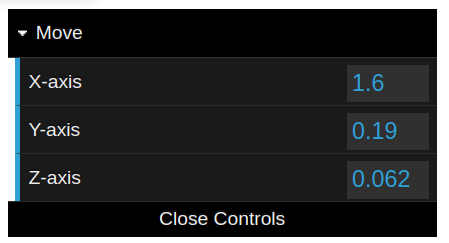

===========================
Operation
===========================
The operations is concerned with the manipulation of the structure, such as removing, rotating, and modifying the atoms. WEAS allow you to roll back and redo the operations.

Python API
===========================

The operations can be accessed through the `viewer.ops` object. The operations are divided into different categories:

- `mesh`
- `atoms`
- `selection`
- `transform`
- `object`

Mesh
---------------------------
For example, to create a new mesh primitive:

.. code-block:: python

    viewer.ops.mesh.add_sphere()
    viewer.ops.mesh.add_cube(position = [5, 0, 0], size=2.5)

Atoms
---------------------------

.. code-block:: python

   # replace selected atoms with a new atom
   viewer.ops.atoms.replace(symbol = "N")

Selection
---------------------------

.. code-block:: python

   viewer.ops.selection.select_all()
   viewer.ops.selection.invert_selection()

Transform
---------------------------

.. code-block:: python

   viewer.ops.transform.translate(vector = [5, 0, 0])

Object
---------------------------

.. code-block:: python

   viewer.ops.object.delete()

Operation history
===========================

Undo & Redo
---------------------------
The `Undo` and `Redo` buttons on the top right of the screen allow you to roll back and redo the operations.

Adjust last operation
---------------------------
You can adjut the parameters of an operator after running it. After your operation, a panel will pop-up in the bottom left. Alternatively, you can click ``l`` (lowcase L) key to pop-up the panel.

For example, if your last operation was a movement, The panel will show you the last value changed for the movement vector, where you can adjut the value and apply it again.

