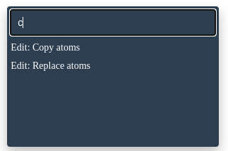

======================
Operator Search
======================

The Operator Search pop-up lets you search for a certain operator and execute it. This is particularly beneficial for users looking to execute advanced operations not readily exposed in the GUI.

Shortcut: `Ctrl + F`

