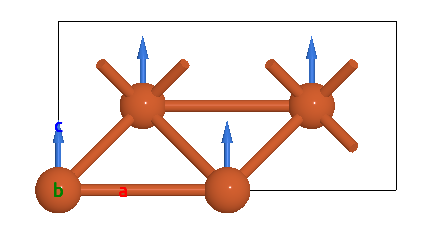

Vector Field
=================

The vector field is defined by the origins and vectors, and it is visualized by the arrows. The vector field is useful for visualizing the magnetic moment, phonon visualization, etc.

Magentic moment visualization
-----------------------------
Show the magnetic moment as a vector field.

.. code-block:: python

    from ase.build import bulk
    from weas_widget import WeasWidget
    import numpy as np
    atoms = bulk("Fe", cubic=True)
    atoms*=[2, 2, 1]
    atoms.set_array("moment", np.ones(len(atoms)))
    viewer = WeasWidget()
    viewer.from_ase(atoms)
    viewer.modelStyle = 1
    viewer

Interactive phonon visualization
--------------------------------
One can visualize the phonon dispersion via lattice vibrations. One only need to use the eigenstates (calculated with an external software) to generate the trajectory.

.. code-block:: python

    import numpy as np
    from ase.build import bulk
    from weas_widget import WeasWidget
    from weas_widget.utils import generate_phonon_trajectory

    atoms = bulk("Fe", cubic=True)
    eigenvector = np.array([[0, -0.0, 0.5], [0, 0.0, -0.5]])
    trajectory = generate_phonon_trajectory(atoms, eigenvector, repeat=[4, 4, 1])
    viewer = WeasWidget()
    viewer.from_ase(trajectory)
    # set a vector field to show the arrow
    viewer.vectorField = [{"origins": "positions", "vectors": "movement", "radius": 0.1}]
    viewer

.. figure:: _static/images/example-phonon.gif
   :align: center
