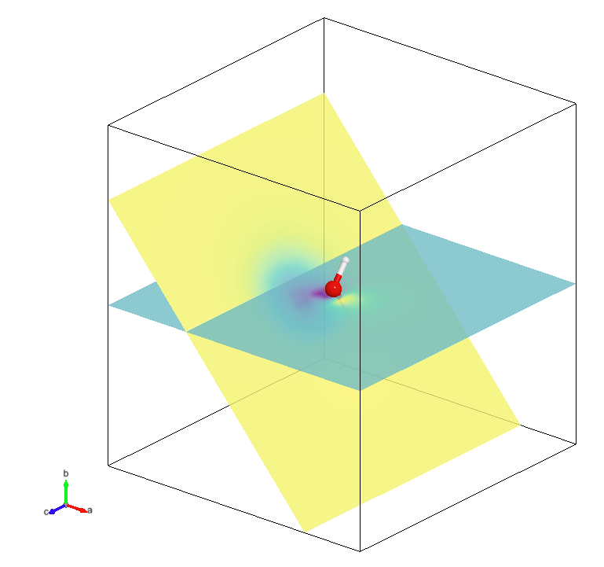

Volume Slice
=================

The volume slice is a 2D cross-sectional visualization of 3D volumetric data. It is an effective method for analyzing volumetric properties, such as molecular orbitals or charge densities, by slicing through the data at specified orientations and distances.

Usage Example
-------------
Here is an example of drawing volume slices for the HOMO of the H2O molecule.

.. code-block:: python

   from ase.build import molecule
   from weas_widget import WeasWidget
   from ase.io.cube import read_cube_data
   volume, atoms = read_cube_data("h2o-homo.cube")
   viewer = WeasWidget()
   viewer.from_ase(atoms)
   viewer.avr.model_style = 1
   viewer.avr.volume_slice.volumetric_data = {"values": volume}
   viewer.avr.volume_slice.settings = {
       "Slice 1": {"h": 0, "k": 1, "l": 0, "distance": 5.5, "samplingDistance": 0.1},
       "Slice 2": {"h": 1, "k": 1, "l": 0, "distance": 5.5, "samplingDistance": 0.1},
   }
   viewer.camera.setting = {"direction": [0.5, 1, 2], "zoom": 1.5}
   viewer

For the ``settings``:

- **h, k, l**: Miller indices defining the orientation of the slice.
- **distance**: The distance of the slice from the origin, in Ångstroms.
- **samplingDistance**: The sampling distance for rendering the slice, affecting resolution.

.. tip::

   Support for multiple slices with individual settings, allowing analysis from different orientations and depths.
